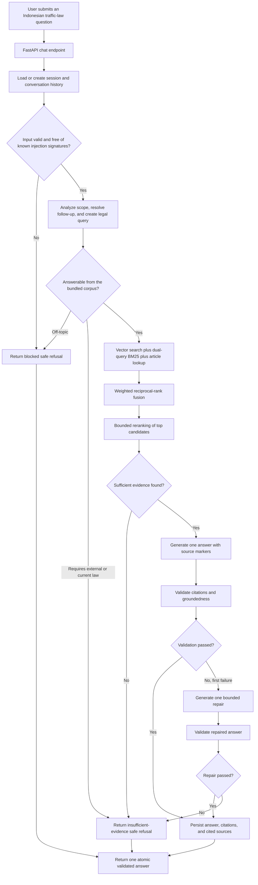
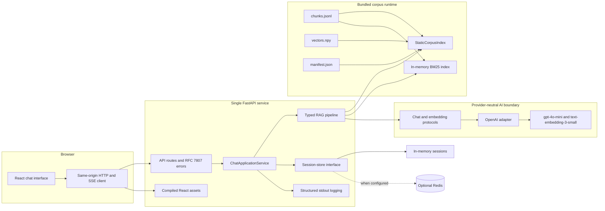

# Tanya Lalin

Tanya Lalin (short for *Tanya Lalu Lintas*) is a portfolio-grade retrieval-augmented
generation (RAG) application for asking questions about Indonesian road traffic and
transportation law. It turns everyday Indonesian questions into answers grounded in the
original text and official elucidation of **Law No. 22 of 2009 on Road Traffic and
Transportation (UU No. 22 Tahun 2009 tentang LLAJ)**, with traceable article-level
citations.

The project is deliberately small enough to understand end to end, but it applies a
production-minded quality bar: explicit typed boundaries, hybrid retrieval, bounded model
use, validated citations, safe refusals, reproducible evaluation, structured operational
logs, automated tests, and one deployable web image.

> **Legal and corpus boundary:** Tanya Lalin is an informational and educational tool, not
> legal advice. Its corpus represents the original 2009 law and official elucidation. It
> does not consolidate later amendments, Constitutional Court decisions, implementing
> regulations, or current local policy. Model-generated answers may still be incomplete or
> incorrect; verify important decisions against current official sources or a qualified
> legal professional.

## What the project demonstrates

- A single FastAPI application serving `/api/v2/*` and the compiled React interface.
- A provider-neutral AI boundary with an OpenAI adapter using `gpt-4o-mini` and
  `text-embedding-3-small`.
- Exact vector search, dual-query BM25, explicit article lookup, weighted reciprocal-rank
  fusion, and bounded reranking.
- Atomic answers emitted only after citation and groundedness validation.
- Safe refusal for prompt injection, off-topic questions, and questions that require legal
  sources outside the bundled corpus.
- Status-only Server-Sent Events (SSE), without streaming unvalidated answer tokens.
- In-memory sessions by default and optional asynchronous Redis persistence.
- A committed, checksum-verified corpus index that requires no embedding call at startup.
- Python 3.12, uv, Ruff, strict TypeScript, coverage gates, CI, Docker, and Compose.

## Intended use

Tanya Lalin is intended for:

- exploring how Indonesian traffic-law questions can be answered from cited primary text;
- demonstrating a complete RAG system in a software-engineering portfolio;
- testing retrieval, citation, refusal, and answer-quality evaluation techniques; and
- serving as a focused reference implementation for a small, static legal corpus.

It is not intended to provide case-specific legal representation, determine liability,
replace an official consolidated legal database, or answer questions whose authority lies
outside Law No. 22 of 2009.

## User-to-answer flow

The synchronous and SSE endpoints consume the same application-service event stream. SSE
reports progress stages, while the final answer is delivered once, after validation.



The normal successful path makes one generation call. A second generation call is allowed
only as a bounded repair after citation or groundedness validation fails. A rejected answer
is never exposed to the browser.

## Architecture

The production image is one web service. The only optional runtime dependency is Redis;
OpenAI is the configured external AI provider.



`create_app(settings=None, container=None)` is a directly testable application factory.
During FastAPI lifespan, `AppContainer` validates the corpus, selects the session store,
constructs the provider adapter, and wires one chat application service. The RAG package
depends on generic chat and embedding contracts rather than OpenAI-specific response types.

### Main boundaries

```text
backend/app/
  api/             HTTP schemas, routes, SSE framing, and problem details
  application/     session-aware chat use case and application events
  rag/             typed analysis, retrieval, reranking, generation, and validation
  infrastructure/  corpus, AI adapter, sessions, logging, tracing, and rate limits
backend/eval/       ground truth, baseline, reports, and evaluation pipeline
corpus/             committed chunks, vectors, and compatibility manifest
frontend/src/
  api/              same-origin API schemas and SSE client
  features/chat/    chat state, answer cards, citations, and source navigation
```

## Retrieval and answer generation

For an in-scope question, query analysis produces a standalone conversational question, a
formal legal query, and useful legal phrases. If model analysis is unavailable, the system
falls back to the original query and deterministic Indonesian legal-term mappings.

Retrieval then combines independent ranked lists:

1. exact cosine search over normalized OpenAI embeddings;
2. BM25 over both the standalone and legal queries;
3. deterministic lookup when the question explicitly names `Pasal N`; and
4. family-normalized weighted reciprocal-rank fusion (RRF).

The top 20 fused candidates remain available internally. `gpt-4o-mini` reranks ten
candidates, and the best five evidence chunks are supplied to answer generation. Vector
relevance, BM25 rank, fusion score, and reranker score remain separate internal values; a
fusion score is never presented as semantic similarity.

Generated source markers use stable `[S1]`, `[S2]`, and similar identifiers. Only sources
actually cited by the validated answer are returned to the frontend and persisted in
session history.

## Corpus and provenance

The legal source is Law No. 22 of 2009 and its official elucidation. The corpus manifest
links to the [official BPK regulation page](https://peraturan.bpk.go.id/Details/38654/Uu-No-22-Tahun-2009)
and records the source identity, effective date, legal status, verification date, corpus
version, model compatibility, and artifact checksums.

The source PDF was initially extracted with
[**PyMuPDF**](https://pymupdf.readthedocs.io/en/latest/about.html#license-and-copyright)
using structure-aware recognition
of articles, paragraphs, the main body, and the elucidation. The extracted content was then
cleaned and converted into the current canonical schema with stable chunk IDs and
provenance. Empty entries and 391 non-informative elucidation entries such as normalized
variants of `Cukup jelas` were removed, leaving **823 useful chunks**.

The committed runtime artifacts are:

| Artifact | Purpose |
| --- | --- |
| `corpus/chunks.jsonl` | Stable legal chunks, structure, text, and provenance |
| `corpus/vectors.npy` | Normalized `float32` embeddings in exact chunk order |
| `corpus/manifest.json` | Versions, model identity, counts, checksums, and source scope |

The vector matrix uses OpenAI `text-embedding-3-small` at **1,536 dimensions**. It is loaded
with NumPy memory mapping and searched by matrix multiplication. This exact search is
simple and fast enough for 823 chunks. Runtime and Docker builds consume the committed
index offline and never call the embedding API.

The source PDF and intermediate extraction files are not committed. The legacy v1 parser
is also not retained: it generated an obsolete pair of body/elucidation JSONL files and did
not implement the canonical cleaning, stable IDs, provenance, ordering, or checksum
contract needed to reproduce the current index.

Verify the committed corpus without provider access:

```bash
make corpus-verify
```

Rebuilding only the vector matrix and manifest from the canonical chunks requires an
OpenAI key:

```bash
make corpus-build
```

## Evaluation

RAG evaluation must test more than whether a retrieved article looks relevant. A system
can retrieve the correct law but omit an important condition, cite an unused source,
answer a question that should be refused, or return malformed output. Tanya Lalin therefore
evaluates retrieval, answer completeness, citations, refusal behavior, reliability, and
latency separately.

### Evaluation-data provenance

The realistic consultation-style seed data comes from the Hugging Face dataset
[`ShoAnn/legalqa_klinik_hukumonline`](https://huggingface.co/datasets/ShoAnn/legalqa_klinik_hukumonline). An
extraction step selected **107 records** whose answers referenced either
`Undang-Undang Nomor 22 Tahun 2009` or `UU LLAJ`.

Those records were used carefully:

1. questions were sanitized and used only as inspiration for realistic Indonesian wording;
2. source answers were processed locally only to extract possible article hints;
3. Hukumonline answers and nested contexts were neither treated as legal ground truth nor
   sent to OpenAI;
4. official chunks from the bundled corpus were the only legal authority supplied during
   synthetic case generation;
5. candidates received an independent model review and manual review; and
6. promotion required manual confirmation.

The resulting schema-version-2 suite contains **100 cases**:

| Cohort | Cases | Expected behavior |
| --- | ---: | --- |
| Answerable | 80 | Answer using cited bundled evidence |
| Insufficient evidence | 10 | Refuse because other or current legal sources are required |
| Blocked | 10 | Block off-topic or prompt-injection input |

The suite is split deterministically into 70 development cases and 30 held-out test cases.
The held-out split is reported separately to make post-hoc retrieval tuning visible and to
reduce optimistic conclusions from development-only results. The suite is manually
reviewed, but it is not represented as expert-certified legal advice.

### What the metrics measure

| Metric | What it answers |
| --- | --- |
| Article Hit@5 | Did at least one expected article appear in the first five unique articles? |
| Article Recall@5 | What fraction of all expected articles appeared in the first five? |
| Article MRR@5 | How early did the first expected article appear? Earlier is better. |
| Article nDCG@5 | Were multiple expected articles ranked near the top, with higher positions rewarded? |
| Evidence Hit/Recall@5 | Did retrieval find the exact expected chunks, and what fraction were found? |
| Required-fact recall | What fraction of manually reviewed required fact groups appeared in the answer? |
| Complete-answer rate | What fraction of answerable cases included every required fact group? |
| Status accuracy | Did the system answer, block, or refuse with insufficient evidence correctly? |
| False-answer rate | How often did the system answer a case that should have been refused? |
| False-refusal rate | How often did the system refuse an answerable case? |
| Structural citation validity | Did every citation marker resolve uniquely to a returned cited source? |
| Crashes and malformed output | Did the pipeline fail or violate its typed output contract? |
| Mean latency | How long did one complete end-to-end pipeline execution take? |

Retrieval metrics apply only to the 80 answerable cases. Refusal cases receive `null`
retrieval scores rather than automatic perfect scores. The real-provider evaluator executes
the complete pipeline once per case, so retrieval, status, answer, citations, and latency
come from the same run. Required facts are judged with structured model output; judge
failures are counted instead of silently treated as correct.

### BM25 baseline versus release hybrid retrieval

The canonical BM25 baseline searches the original question and needs no provider secret.
It is a diagnostic control rather than a release gate. The release hybrid uses vector
search, standalone/legal BM25, explicit article lookup, family-normalized RRF, and
`gpt-4o-mini` reranking. Both tables below use the same 100-case suite and corpus version;
retrieval aggregates cover the 80 answerable cases.

| Metric | BM25 overall | Hybrid overall | BM25 held-out | Hybrid held-out |
| --- | ---: | ---: | ---: | ---: |
| Article Hit@5 | 80.00% | **85.00%** | 75.00% | **79.17%** |
| Article Recall@5 | 68.23% | **73.44%** | 59.72% | **63.89%** |
| Article MRR@5 | 0.6994 | **0.8031** | 0.6458 | **0.7500** |
| Article nDCG@5 | 0.6453 | **0.7290** | 0.5743 | **0.6506** |
| Evidence Recall@5 | 51.64% | **61.83%** | 34.81% | **45.99%** |
| Evidence nDCG@5 | 0.5205 | **0.6357** | 0.3891 | **0.5021** |

The hybrid configuration improves every listed aggregate and held-out retrieval metric.
However, held-out Article Hit@5 is **79.17%**, below the aspirational 85% target. Candidate
Article Hit@20 reaches 95.83% on held-out cases, indicating that relevant articles are
usually present before final reranker selection. This limitation is reported rather than
hidden or tuned against the held-out labels.

Canonical reports:

- [`backend/eval/baseline-bm25.json`](backend/eval/baseline-bm25.json): secret-free BM25
  baseline.
- [`backend/eval/results/eval-20260831T075520Z.json`](backend/eval/results/eval-20260831T075520Z.json):
  latest 100-case release evaluation.

### Latest application-level results

| Metric | Result |
| --- | ---: |
| Overall status accuracy | 97.00% |
| Answerable status accuracy | 96.25% |
| Blocked accuracy | 100.00% |
| Insufficient-evidence accuracy | 100.00% |
| False-answer rate | 0.00% |
| False-refusal rate | 3.75% |
| Required-fact recall | 76.83% |
| Complete-answer rate | 56.25% |
| Structural citation validity | 100.00% |
| Crashes / malformed outputs / fact-judge errors | 0 / 0 / 0 |
| Mean end-to-end latency | 6.93 seconds |

The safety and reliability gates are sufficient for this portfolio MVP. Retrieval and
answer completeness remain explicit improvement areas, not reasons to claim the system is
a complete legal research product.

Run the real-provider evaluation manually:

```bash
make eval
```

This command requires `OPENAI_API_KEY`, incurs provider usage, and writes a new immutable
report. CI uses deterministic fakes and never requires provider credentials.

## Public API

Application release `2.0.0` uses `/api/v2` because the rearchitecture introduced a
breaking request, response, history, health, error, citation, and streaming contract. The
retired `/api/v1` prefix is not retained as a compatibility alias.

| Method | Path | Purpose |
| --- | --- | --- |
| `POST` | `/api/v2/chat` | Return one validated answer |
| `POST` | `/api/v2/chat/stream` | Stream progress and one atomic complete response |
| `GET` | `/api/v2/chat/{session_id}/history` | Restore messages with citations and sources |
| `DELETE` | `/api/v2/chat/{session_id}` | Delete a session |
| `GET` | `/api/v2/health/live` | Process liveness |
| `GET` | `/api/v2/health/ready` | Corpus, provider, and session-store readiness |

Chat request:

```json
{
  "message": "Apa sanksi menerobos lampu merah?",
  "session_id": "optional-uuid"
}
```

The response status is `answered`, `blocked`, or `insufficient_evidence`. Errors use RFC
7807-compatible problem details with an `error_code` and `request_id`. Every HTTP response
also includes `X-Request-ID`.

The streaming endpoint emits JSON SSE events in this shape:

- `meta`: request and session IDs;
- `status`: `validating`, `analyzing`, `retrieving`, `reranking`, `generating`, or
  `verifying`;
- `complete`: one complete `ChatResponse`; or
- `error`: problem details if a failure occurs after the stream opens.

It never emits answer-token events.

## Local development

Requirements:

- Python 3.12;
- [uv](https://docs.astral.sh/uv/);
- Node.js 20; and
- an OpenAI API key for live chat and real-provider evaluation.

Install dependencies:

```bash
cp .env.example .env
# Set OPENAI_API_KEY in .env
make install
```

Run FastAPI:

```bash
cd backend && uv run uvicorn app.main:create_app --factory --reload
```

Run Vite in another terminal:

```bash
cd frontend && npm run dev
```

Open `http://127.0.0.1:5173`. Vite proxies `/api` to FastAPI. Production remains
same-origin and disables CORS unless `CORS_ORIGINS` is explicitly configured.

### Quality gates

```bash
make check
```

The gate runs Ruff lint and formatting checks, strict TypeScript, ESLint with zero
warnings, backend and frontend tests with coverage, the production frontend build, and
corpus verification. Current thresholds are 85% backend line coverage, 90% coverage for
`app/rag`, and 80% statement coverage for the frontend chat feature.

Useful commands:

| Command | Purpose |
| --- | --- |
| `make install` | Install locked backend and frontend dependencies |
| `make lint` | Run Ruff and ESLint checks |
| `make format` | Format and autofix supported source files |
| `make test` | Run backend and frontend tests with coverage |
| `make build` | Build the React production assets |
| `make corpus-verify` | Verify bundled corpus integrity offline |
| `make docker-build` | Build the single production image |
| `make up` / `make down` | Start or stop the default Compose application |

## Container deployment

Compose reads `OPENAI_API_KEY` from the local `.env` at runtime. The key is not a Docker
build argument and is excluded from the build context.

```bash
docker compose up --build
```

Open `http://127.0.0.1:8000`.

The default deployment uses one application worker and in-memory sessions. This is the
zero-infrastructure mode and is appropriate for a portfolio deployment. In-memory state is
process-local and disappears on restart. Multiple workers or persistent/shared sessions
require Redis:

```bash
REDIS_URL=redis://redis:6379/0 docker compose --profile redis up --build
```

A configured Redis outage fails startup/readiness rather than silently changing storage
semantics. The application logs structured operational metadata to stdout and does not log
question or answer content by default.

## Configuration

`.env.example` is the supported configuration reference. Important settings include:

| Area | Defaults |
| --- | --- |
| Chat model | `gpt-4o-mini` |
| Embeddings | `text-embedding-3-small`, 1,536 dimensions |
| Retrieval | 20 vector, 20 BM25, 20 fused, 5 final evidence chunks |
| Reranker | Enabled, ten candidates, `gpt-4o-mini` |
| Sessions | In memory, 24-hour TTL, 40 stored messages |
| Chat rate limit | 10 requests per minute per trusted client address |
| Logging | Human-readable in development, JSON in production |
| Tracing | Optional LangSmith integration, disabled by default |

Do not commit `.env`. The browser never receives the provider key.

## License

Tanya Lalin is licensed under the **GNU Affero General Public License v3.0**. See
[`LICENSE`](LICENSE).

PyMuPDF, used during the original PDF extraction stage, is available under AGPL and
commercial licensing. Keeping this project under AGPL-3.0 was partly chosen to align with
that open-source toolchain. AGPL is also a deliberate fit for a network-served application:
operators who provide a modified version over a network must make the corresponding source
available under the license terms. This licensing note describes the project choice; it is
not a claim that the extracted statutory text itself becomes governed by PyMuPDF's license,
and it is not legal advice.
